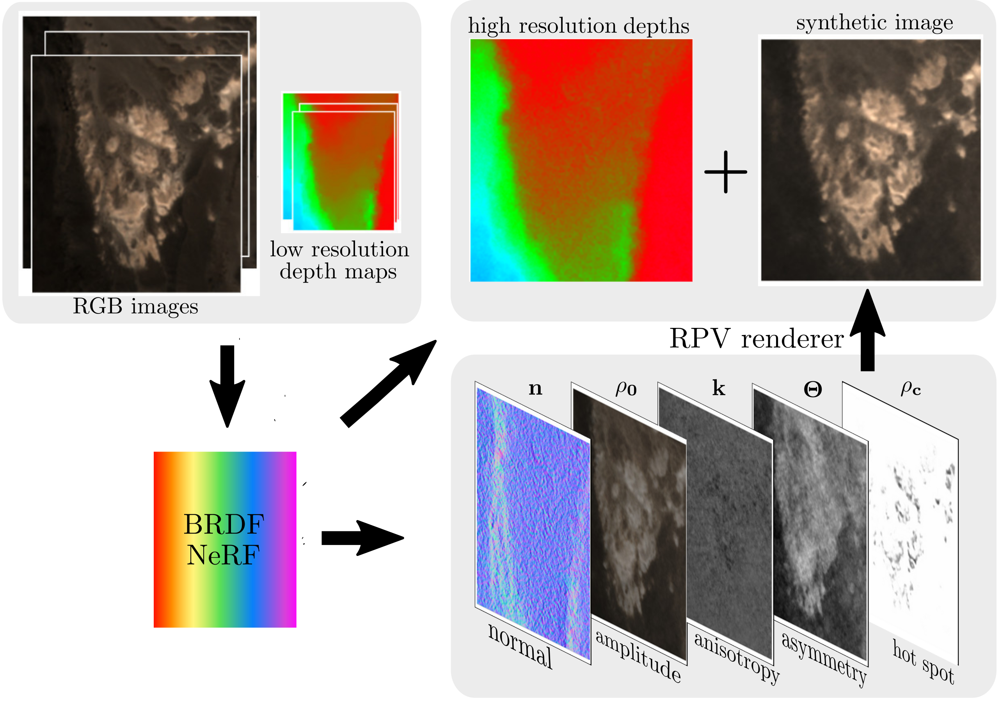

# BRDF-NeRF

### [BRDF-NeRF: Neural Radiance Fields with Optical Satellite Images and BRDF Modelling](https://arxiv.org/abs/2409.12014)
*[Lulin Zhang](https://scholar.google.com/citations?user=tUebgRIAAAAJ&hl=fr&oi=ao),
[Ewelina Rupnik](https://erupnik.github.io/),
[Tri Dung Nguyen](https://fr.linkedin.com/in/tri-dung-nguyen-738a57262),
[Stéphane Jacquemoud](https://www.ipgp.fr/~jacquemoud/),
[Yann Klinger](https://www.ipgp.fr/~klinger/)*





## Setup
### Compulsory
The following steps are compulsory for running this repository:
1. Clone the git repository 
```
git clone https://github.com/LulinZhang/BRDF-NeRF.git
```

2. Create virtualenv `spsnerf`
```
conda init
bash -i setup_spsnerf_env.sh
```

### Optional
If you want to prepare the dataset yourself, you'll need to create virtualenv `ba`:
```
conda init
bash -i setup_ba_env.sh
```

## 1. Prepare dataset
You can skip this step and directly download the [Djibouti dataset](https://drive.google.com/file/d/1UFuEiG-_fNTTl22ZHzxiTy0wJi66qfHz/view?usp=sharing).

*You need to prepare a directory `ProjDir` to place the dataset.*

### 1.1. Refine RPC with bundle adjustment
Please use command `conda activate ba` to get into the `ba` environment for this step.
```
aoi_id=Dji_012
dsm_dir='/home/Documents/DSM/'
dsm_file='Z_Num8_DeZoom1_STD-MALT.tif'
coor_left=214430.250
coor_upper=1286916.750
resolution=0.5
img_dir='/home/Documents/Image'
python3 generate_dataset.py --aoi_id "$aoi_id" --dsm_dir "$dsm_dir" --dsm_file "$dsm_file" --coor_left "$coor_left" --coor_upper "$coor_upper" --resolution "$resolution" --img_dir "$img_dir"
```

*Please replace the values in the above script to your own value.*

### 1.2. Generate dense depth
#### Option 1: Use software MicMac
In our experiments, this step is done with the free, open-source photogrammetry software `MicMac`. You need to install MicMac following [this websit](https://github.com/micmacIGN/micmac).

You'll need the [WGS84toUTM.xml](https://drive.google.com/file/d/1KfcD4oHBCK6uw2fxaFozqN2S1u8cyqyP/view?usp=sharing) for coordinate transformation.

```
datadir=/home/Documents/Dji_012_3_imgs/
aoi_id=Dji_012
cp "$datadir"/dataset"$aoi_id"/"$aoi_id"/RGB-crops/"$aoi_id"/scled/*.tif .
cp "$datadir"/ba_files/rpcs_adj/*.rpc_adj .

for file in *.rpc_adj
do
filename="${file%.rpc_adj}"
mv -- "$file" "$filename".txt
done

mm3d Convert2GenBundle "(.*).tif" "\$1.txt" RPC-d0-adj ChSys=WGS84toUTM.xml Degre=0

zm=4
out_dir="$datadir"/dataset"$aoi_id"/root_dir/crops_rpcs_ba_v2/"$aoi_id"/
for file in *.tif
do
filename="${file%.tif}"
mm3d Malt GeomImage ".*tif" RPC-d0-adj Master="$filename".tif SzW=1 Regul=0.05 NbVI=2 ZoomF="$zm" ResolTerrain=1 EZA=1 DirMEC=MM-"$filename"_ZM"$zm"/ 
mm3d TestLib GeoreferencedDepthMap MM-"$filename"_ZM"$zm" "$filename".tif Ori-RPC-d0-adj OutDir="$out_dir"DenseDepth_ZM"$zm"/ Mask=1 Scale="$zm"
done
```

*Please replace the values in the above script to your own value.*

#### Option 2: Use other software
It is also possible if you prefer to use other software, just make sure your final result is organized this way:
- `DenseDepth_ZM4`
  - `ImageName_2DPts.txt`: 2D coordinate in image frame for the pixels with valid depth value. The first line is width, and the second line is height.
  - `ImageName_3DPts.txt`: 3D coordinate in UTM for the pixels with valid depth value.
  - `ImageName_Correl.txt`: correlation score for the pixels with valid depth value.

## 2. Train SpS-NeRF
Please use command `conda activate spsnerf` to get into the `spsnerf` environment for this step.

### 2.1 Pretrain the geometric part with Lambertian assumption
```
aoi_id=Dji_012
ds_lambda=10
scale=1
visu_scale=2
max_train_steps=100000
ProjDir=/gpfs/users/lzhang/Dji_012_3imgs/
exp_name=BRDF-NeRF-"$aoi_id"-ds"$ds_lambda"_Imscl"$scale"-Lam
Output="$ProjDir"/"$exp_name"

python3 main.py --aoi_id "$aoi_id" --model spsbrdf-nerf --exp_name "$exp_name" --root_dir "$ProjDir"/dataset"$aoi_id"/root_dir/crops_rpcs_ba_v2/"$aoi_id"/ --img_dir "$ProjDir"/dataset"$aoi_id"/"$aoi_id"/RGB-crops/"$aoi_id"/ --cache_dir "$Output"/cache_dir/crops_rpcs_ba_v2/"$aoi_id" --gt_dir "$ProjDir"/dataset"$aoi_id"/"$aoi_id"/Truth --logs_dir "$Output"/logs --ckpts_dir "$Output"/ckpts --max_train_steps "$max_train_steps" --ds_lambda "$ds_lambda" --mapping --visu_scale "$visu_scale" --scale "$scale"
```

*Please replace the value of `ProjDir` in the above script to your own value.*

### 2.2 Train the BRDF part
```
aoi_id=Dji_012
ds_lambda=10
normal=analystic
scale=1
visu_scale=2
lr=0.0002152
max_train_steps=80000
cos_irra_on=0
brdf_on=0
funcM=1
funcF=1
funcH=1
ProjDir=/gpfs/users/lzhang/Dji_012_3imgs/
in_ckpts=/gpfs/users/lzhang/Dji_012_3imgs//BRDF-NeRF-Dji_012-ds10_Imscl1-Lam/ckpts/epoch\=9.ckpt
exp_name=BRDF-NeRF-"$aoi_id"-ds"$ds_lambda"-ir"$cos_irra_on"_Imscl"$scale"-nr"$normal"-bo"$brdf_on"-RPV"$funcM""$funcF""$funcH"
Output="$ProjDir"/"$exp_name"

python3 main.py --aoi_id "$aoi_id" --model spsbrdf-nerf --exp_name "$exp_name" --root_dir "$ProjDir"/dataset"$aoi_id"/root_dir/crops_rpcs_ba_v2/"$aoi_id"/ --img_dir "$ProjDir"/dataset"$aoi_id"/"$aoi_id"/RGB-crops/"$aoi_id"/ --cache_dir "$Output"/cache_dir/crops_rpcs_ba_v2/"$aoi_id" --gt_dir "$ProjDir"/dataset"$aoi_id"/"$aoi_id"/Truth --logs_dir "$Output"/logs --ckpts_dir "$Output"/ckpts --max_train_steps "$max_train_steps" --lr "$lr" --ds_lambda "$ds_lambda" --mapping --in_ckpts "$in_ckpts" --normal "$normal" --brdf_on "$brdf_on" --visu_scale "$visu_scale" --scale "$scale" --funcM "$funcM" --funcF "$funcF" --funcH "$funcH" --cos_irra_on "$cos_irra_on"
```

## 3. Test SpS-NeRF
Please use command `conda activate spsnerf` to get into the `spsnerf` environment for this step.
```
root_dir=/gpfs/users/lzhang/Dji_012_3imgs//BRDF-NeRF-Dji_012-ds10-ir0_Imscl1-nranalystic-bo0-RPV111/
logs_dir="$root_dir"/logs/
Output="$root_dir"/eval/
epoch_number=40
split=eval

python3 eval.py --logs_dir "$logs_dir" --output_dir "$Output" --epoch_number "$epoch_number" --split "$split"
```

*Please replace the values in the above script to your own value.*

## Citation
If you find this code or work helpful, please cite:
```
@misc{zhang2024brdfnerfneuralradiancefields,
      title={BRDF-NeRF: Neural Radiance Fields with Optical Satellite Images and BRDF Modelling}, 
      author={Lulin Zhang and Ewelina Rupnik and Tri Dung Nguyen and Stéphane Jacquemoud and Yann Klinger},
      year={2024},
      eprint={2409.12014},
      archivePrefix={arXiv},
      primaryClass={cs.CV},
      url={https://arxiv.org/abs/2409.12014}, 
}
```
